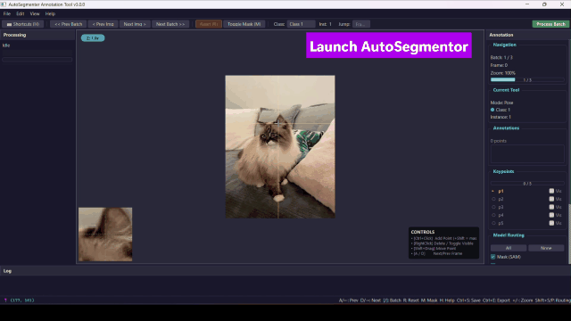

# AutoSegmentor

[](https://github.com/thippeswammy/AutoSegmentor)
[](https://thippeswammy.github.io/AutoSegmentor/)
[](https://drive.google.com/file/d/1Y19lwf_IIuzwVe-3j9vX0uicV_iWbrHZ/view?usp=sharing)



_AutoSegmentor is a state-of-the-art auto-labeling ecosystem that bridges the gap between raw video footage and structured AI datasets. By integrating Meta AI's **Segment Anything Model 2 (SAM2)** with high-precision tracking like **CoTracker3**, it enables users to generate pixel-perfect masks and pose estimation data for long, complex videos with minimal manual interaction._

**📖 [Full documentation, demos, and architecture guide →](https://thippeswammy.github.io/AutoSegmentor/)**

---

## ✨ Features

- **Professional Desktop UI**: A fully-featured PyQt5 application with multi-window support, integrated property panels, and real-time visualization.
- **Interactive Annotation**: Point and box-based multi-class annotation with a high-fidelity zoom system for precision.
- **Advanced Tracking (CoTracker3)**: Robust keypoint tracking across frames — an alternative to Optical Flow for complex scenes.
- **Real-time Mask Propagation**: Propagate annotations across batches of frames using SAM2's temporal memory.
- **Async Processing Engine**: Background execution of GPU tasks keeps the UI responsive during heavy inference.
- **YOLO Dataset Creation**: One export covers **object detection (bbox)**, **instance segmentation**, and **pose estimation** simultaneously, with integrated augmentation.

## 🚀 Quickstart

Tested on **Windows 11** and **Ubuntu 22.04/24.04**. Full walkthrough (prerequisites,
manual install path, troubleshooting):
**[Installation guide →](https://thippeswammy.github.io/AutoSegmentor/installation/)**

```bash
git clone --recursive https://github.com/thippeswammy/AutoSegmentor.git
cd AutoSegmentor
python -m venv .venv && source .venv/bin/activate   # or .venv\Scripts\Activate.ps1 on Windows
python install.py
python run_main.py --demo cat
```

`install.py` is a single cross-platform script that installs dependencies, initializes
submodules, downloads the SAM2 + CoTracker3 checkpoints, and runs a GPU diagnostic — see
`python install.py --help` for flags to skip or isolate individual steps.

## 🎬 Demos

```bash
python run_main.py --demo list           # cat, road
python run_main.py --demo cat
python run_main.py --demo road
```

See **[Demos →](https://thippeswammy.github.io/AutoSegmentor/demos/)** for a shot-by-shot
walkthrough of the GIF above, what each bundled demo shows, and how to run the pipeline on
your own footage.

## ⌨️ Annotation Controls

| Action | Control |
| :--- | :--- |
| **Foreground Point** | Left Click |
| **Background Point** | Right Click |
| **Undo / Redo** | `Ctrl + Z` / `Ctrl + Y` |
| **Navigate Frames** | `A` / `D` or `Left` / `Right` |
| **Turbo Scroll** | `Shift + A` / `Shift + D` |
| **Batch Navigation** | `[` / `]` |
| **Change Class (1-10)** | Keys `1` to `0` |
| **Instance Management** | `Tab` (Next) / `Shift + Tab` (Prev) |
| **Toggle Mask Overlay** | `M` |
| **Process Batch** | `Enter` / `Return` |
| **Save Progress** | `Ctrl + S` |
| **Export Dataset** | `Ctrl + E` |

## 🏗️ Architecture

A PyQt5 annotation UI drives a background engine wrapping SAM2 (mask propagation) and
CoTracker3 (keypoint tracking), with a separate downstream toolchain (`DatasetManager/`)
turning verified annotations into YOLO-format training data. For the full call flow,
diagram, and package breakdown, see the
**[Architecture guide →](https://thippeswammy.github.io/AutoSegmentor/architecture/)**.

```text
AutoSegmentor/
├── run_main.py                # Main entry point
├── install.py                 # One-shot setup (deps, submodules, checkpoints, GPU check)
├── autosegmentor/              # Core application package (core, ui, models, file_management, tools)
├── DatasetManager/              # Dataset export & synthesis — see the Dataset Manager guide
├── workspace/                  # Project workspace (videos in, datasets/logs out)
├── external/                   # Vendored SAM2 + CoTracker3
├── demo/                        # Bundled demo footage + session configs
└── docs/                        # Source for the documentation site
```

## Acknowledgements

- [Meta AI's SAM2](https://github.com/facebookresearch/segment-anything-2)
- [CoTracker Team](https://github.com/facebookresearch/co-tracker)
- All open-source contributors to the PyTorch and PyQt ecosystems.

---

**Built with ❤️ for the Computer Vision community.**
