# AutoSegmentor

[](https://github.com/thippeswammy/AutoSegmentor)
[](https://drive.google.com/file/d/1Y19lwf_IIuzwVe-3j9vX0uicV_iWbrHZ/view?usp=sharing)


_AutoSegmentor is a game-changer for anyone working with video data in computer vision. This open-source project provides a comprehensive auto-labeling system that converts raw videos—including long videos and complex scenes—into structured datasets using Meta AI's cutting-edge [Segment Anything Model 2 (SAM2)](https://github.com/facebookresearch/segment-anything)._

**Main purpose:**  
Build an auto-labeling pipeline that converts raw videos into structured YOLO-compatible datasets using SAM2, with real-time segmentation enabled by CUDA acceleration, multithreading, and an interactive GUI annotation system.  
AutoSegmentor supports long videos and visually-rich content graphics, making it ideal for both standard and advanced video processing tasks.  
**You can create datasets for any required object or class simply by giving visual prompts—no manual labeling required.**

> **Demo:**  
> [Watch the demo video](https://drive.google.com/file/d/1Y19lwf_IIuzwVe-3j9vX0uicV_iWbrHZ/view?usp=drive_link)

---

## ✨ Features

- **Automated Frame Extraction**: Extracts frames from short or long videos using a robust, configurable pipeline.
- **Interactive Annotation**: Point-based, multi-class annotation with real-time OpenCV GUI.
- **Batch & Real-time Processing**: Efficient batch segmentation with CUDA and multithreading.
- **Mask Prediction & Overlay**: Predicts masks with SAM2 and overlays for easy verification.
- **Robust Pose Estimation**: Integrated CoTracker support for tracking keypoints across frames with high accuracy, offering a robust alternative to Optical Flow.
- **Output Video Compilation**: Produces original, mask, and overlay videos for review.
- **YOLO Dataset Creation**: Converts masks/images into YOLO format with augmentations.
- **Long Video Support**: Handles visually-rich videos and lengthy footage efficiently.
- **Automatic Directory Management**: Smart handling of temporary and output directories to keep your workspace clean.

---

## 🔧 Setup & Installation

### Prerequisites
- Python 3.8+
- PyTorch (with CUDA for GPU acceleration)
- OpenCV (`opencv-python`), NumPy, GPUtil, tqdm, pygetwindow, Pillow
- **SAM2** library and hierarchical checkpoint (`sam2_hiera_large.pt`)
- Platform dependencies for GUI (e.g., X11 on Linux or compatible display server on Windows)

### Installation Steps

1.  **Clone the Repository**
    ```bash
    git clone https://github.com/thippeswammy/AutoSegmentor.git
    cd AutoSegmentor
    ```

2.  **Install Dependencies**
    ```bash
    pip install torch torchvision opencv-python numpy GPUtil tqdm pygetwindow pillow
    ```
    *Ensure you install the correct PyTorch version for your CUDA version.*

3.  **Download SAM 2 Checkpoint**
    - Download `sam2_hiera_large.pt` from the [SAM 2 repository](https://github.com/facebookresearch/segment-anything).
    - Place it in the `checkpoints/` directory.

---

## Usage

### 1. Prepare Inputs

- Place input videos (including long) in `sam3/inputs/VideoInputs/` (e.g., `Video1.mp4`, `Video2.mp4`, ...).
- Ensure the SAM2 checkpoint and config are in `checkpoints/` and `sam2_configs/`.
- Confirm all custom modules exist in `sam3/utils/`.

### 2. Run the Main Pipeline

- Navigate to the root directory (where `sam3` is located):

```bash
cd path/to/your/AutoSegmentor
python sam3/sam3_video_predictor_demo.py
```
- By default, this loads parameters from `sam3/inputs/config/default_config.yaml`.

#### Custom Configuration

Edit `sam3/inputs/config/default_config.yaml` to control:
- Input video range (`video_start`, `video_end`)
- Filename prefix (`prefix`)
- Processing params (`batch_size`, `fps`)
- Directory paths (e.g., `working_dir_name`, `images_extract_dir`)
- Cleanup policy (`delete`: auto/manual)

**Sample config keys:**
```yaml
video_start: 1
video_end: 2
prefix: "Img"
batch_size: 8
fps: 24
delete: false
working_dir_name: "working_dir"
video_path_template: "sam3/inputs/VideoInputs/Video{}.mp4"
...
```

### 3. Annotation

The annotation and verification processes are orchestrated as part of the pipeline and are highly interactive:

- Uses an OpenCV-based GUI for point-and-click annotation.
- Save annotations as JSON per video in `sam3/inputs/UserPrompts/points_labels_<prefix><video_number>.json`.
- Supported keyboard and mouse controls:
  - **1-9**: Change class label (mapped to `class_to_id`).
  - **Left Click**: Add foreground point.
  - **Right Click**: Add background point.
  - **u**: Undo last point.
  - **r**: Reset points for current frame.
  - **Tab**: Increment instance ID.
  - **Shift + Tab**: Decrement instance ID.
  - **f**: Jump to specific frame index.
  - **Enter**: Save points and proceed.
  - **q**: Quit annotation.

A zoom window shows a magnified area around the cursor for precision annotation.

---

## 🏎 Advanced: Pose Estimation with CoTracker

AutoSegmentor supports advanced keypoint tracking using **CoTracker**, which provides superior performance over traditional Optical Flow (Lucas-Kanade) for complex scenes.

### 1. Setup CoTracker
1.  Ensure the `co-tracker` submodule is present in the root directory.
2.  Download the CoTracker checkpoint (`scaled_offline.pth`) and place it in `co-tracker/checkpoints/`.

### 2. Configuration
Edit `sam3/inputs/config/default_config.yaml` to enable and configure the tracker:

```yaml
pose_estimation:
  enabled: true
  tracker: "cotracker"   # Options: "cotracker" or "lk" (Lucas-Kanade)
  cotracker:
    checkpoint: "../co-tracker/checkpoints/scaled_offline.pth"
    window_len: 60       # Frame window for tracking context
```

---

## 🏗️ System Architecture

AutoSegmentor follows a modular pipeline architecture. The data flows seamlessly from raw input video to structured dataset outputs.

### High-Level Data Flow

```mermaid
flowchart TD
    %% =========================================================
    %% Swimlanes (vertical pipeline)
    %% =========================================================

    subgraph "User / HITL (Human-in-the-loop)"
        U["User / Annotator"]:::external
        UI["OpenCV Annotation GUI\n(UserInteraction)\npoint-clicks,keys,zoom"]:::ui
        AM["AnnotationManager\nsave/load prompts,IDs/classes"]:::ui
        LOG["Logging\n(logger_config)"]:::ui
        JP[("User Prompts JSON\npoints_labels_*.json")]:::store
    end

    subgraph "Orchestration / Control Plane"
        DRIVER["Main Driver\nsam3_video_predictor_demo.py"]:::orch
        PIPE["Pipeline Orchestrator\n(pipeline.py)\nconnects stages end-to-end"]:::orch
        CFG["Runtime Config\n(default_config.yaml)\nvideo_range,fps,batch,dirs,cleanup"]:::doc
    end

    subgraph "Input / Output Artifacts (Data Plane)"
        VIN[("Video Inputs\nVideo*.mp4")]:::store
        WDIR[("working_dir/\nimages,temp,render,overlap,verified")]:::store
        OUTVID[("outputs/\nOrgVideo*.mp4\nMaskVideo*.mp4\nOverlappedVideo*.mp4")]:::store
        CKPT[("SAM2 Checkpoint\nsam2_hiera_large.pt")]:::store
        CKPTDL["Checkpoint Download Script\n(download_ckpts.sh)"]:::tool
        MCFG[("SAM2 Model YAML\nsam2_hiera_*.yaml")]:::doc
    end

    subgraph "FileManagement (ETL stages)"
        FM["FileManager\ndir lifecycle & paths"]:::fm
        FE["FrameExtractor\nmp4->frames"]:::fm
        FH["FrameHandler\nbatching,temp staging"]:::fm
        MP["MaskProcessor\npost-process,colorize,bbox,batch"]:::fm
        OVL["ImageOverlayProcessor\nmask-over-image\nmultithreaded"]:::fm
        CP["ImageCopier\ncurate verified samples"]:::fm
        VC["VideoCreator\nframes->mp4\nmultithreaded"]:::fm
    end

    subgraph "Pose Estimation & Tracking"
        PTRACK["Pose Exporter\n(PoseExporter.py)"]:::fm
        CT["CoTracker Wrapper\n(CoTrackerKeypointTracker)"]:::ml
        LK["Optical Flow (LK)\n(KeypointTracker.py)"]:::ml
        CT_LIB["CoTracker Library\n(co-tracker/)"]:::ml
        CT_CKPT[("CoTracker Weights\nscaled_offline.pth")]:::store
    end

    subgraph "Model Runtime (SAM2 Inference)"
        S2CFG["SAM2Config\nbatch size,colors,paths"]:::ml
        S2M["SAM2Model\nload SAM2,device select,\nGPU mem checks (GPUtil)"]:::ml
        PRED["sam2_video_predictor (sam3)\nprompts+frame/batch inference"]:::ml
        S2LIB["SAM2 Library (vendored)\n(sam2/)"]:::ml
        UPRED["Upstream sam2_video_predictor.py"]:::ml
        GPU{{"PyTorch + CUDA GPU Runtime"}}:::gpu
        CCU["CUDA Extension\nconnected_components.cu"]:::gpu
    end

    subgraph "Dataset Export (YOLOv8 compatible)"
        YDC["YOLO Dataset Builder\n(DatasetCreator)\npolygons,split,augment"]:::ds
        YSTRUCT["YOLO Structure Creator\ncreate_yolo_structure.py"]:::ds
        YDOC["Docs\nREADME.md"]:::doc
        YOLO[("YOLO Dataset Folder\ntrain/valid/test\nlabels(polygons).txt")]:::store
    end

    subgraph "Evaluation / Benchmark (optional)"
        VOS["VOS Inference Tool\nvos_inference.py"]:::tool
        SAVE["SAV Evaluator\nsav_evaluator.py"]:::tool
        SAVU["SAV Benchmark Utils\nsav_benchmark.py"]:::tool
    end

    %% =========================================================
    %% Control-plane flows
    %% =========================================================
    U -->|"clicks/keys(control)"| UI
    UI -->|"events(control)"| AM
    AM -->|"save/load(json)"| JP
    UI -->|"logs"| LOG

    CFG -->|"run_params(control)"| PIPE
    DRIVER -->|"invokes"| PIPE

    CKPTDL -->|"downloads"| CKPT
    MCFG -->|"model_config(control)"| S2CFG
    CKPT -->|"weights(.pt)"| S2M
    S2CFG -->|"paths/colors/batch(control)"| PRED
    S2M -->|"model+device(control)"| PRED
    JP -->|"prompts(json,per-video/control)"| PRED

    %% =========================================================
    %% Data-plane pipeline (ETL)
    %% =========================================================
    VIN -->|"mp4(per-video)"| FE
    PIPE -->|"orchestrates"| FM
    PIPE -->|"orchestrates"| FE
    PIPE -->|"orchestrates"| FH
    PIPE -->|"orchestrates"| PRED
    PIPE -->|"orchestrates"| MP
    PIPE -->|"orchestrates"| OVL
    PIPE -->|"orchestrates"| CP
    PIPE -->|"orchestrates"| VC
    PIPE -->|"orchestrates"| YDC
    PIPE -->|"orchestrates(optional)"| PTRACK

    FE -->|"frames(jpg/png,per-frame)"| WDIR
    FM -->|"create/cleanup dirs"| WDIR

    WDIR -->|"images->batches"| FH
    FH -->|"temp batches(per-batch)"| WDIR

    WDIR -->|"temp frames(per-batch)"| PRED
    PRED -->|"raw masks(per-frame)"| MP
    MP -->|"render masks(color-encoded)"| WDIR

    WDIR -->|"images+render"| OVL
    OVL -->|"overlap images"| WDIR

    WDIR -->|"images/masks/overlap"| CP
    CP -->|"verified/images + verified/mask"| WDIR

    WDIR -->|"images/render/overlap"| VC
    VC -->|"mp4 outputs"| OUTVID

    WDIR -->|"verified or images+render"| YDC
    YDC -->|"creates structure"| YSTRUCT
    YSTRUCT -->|"train/valid/test folders"| YOLO
    YDOC -->|"usage/format"| YDC

    %% =========================================================
    %% Pose Estimation Flows
    %% =========================================================
    WDIR -->|"frames"| PTRACK
    CFG -->|"pose settings"| PTRACK
    PTRACK -->|"selects"| CT
    PTRACK -->|"selects"| LK
    CT -->|"imports"| CT_LIB
    CT_CKPT -->|"loads"| CT
    PTRACK -->|"exports pose data"| WDIR

    %% =========================================================
    %% Compute/resource dependencies
    %% =========================================================
    PRED -->|"calls"| S2LIB
    S2LIB -->|"uses"| UPRED
    PRED -->|"torch ops"| GPU
    GPU -->|"accelerated op"| CCU
    CCU -->|"connected components"| S2LIB

    %% =========================================================
    %% Optional evaluation flow
    %% =========================================================
    OUTVID -->|"evaluate(optional)"| VOS
    YOLO -->|"benchmark(optional)"| SAVE
    SAVE -->|"uses"| SAVU

    %% =========================================================
    %% Click Events (component mapping)
    %% =========================================================
    click DRIVER "sam3/sam3_video_predictor_demo.py" "Main Driver Script"
    click PIPE "sam3/utils/pipeline.py" "Pipeline Logic"
    click CFG "sam3/inputs/config/default_config.yaml" "Config File"

    click JP "DataPoints/points_labels_*.json" "User Prompts"
    click AM "sam3/utils/UserUI/AnnotationManager.py" "Annotation Manager"
    click UI "sam3/utils/UserUI/UserInteraction.py" "UI Logic"
    click LOG "sam3/utils/UserUI/logger_config.py" "Logger Config"

    click FM "sam3/utils/FileManagement/FileManager.py" "File Manager"
    click FE "sam3/utils/FileManagement/FrameExtractor.py" "Frame Extractor"
    click FH "sam3/utils/FileManagement/FrameHandler.py" "Frame Handler"
    click MP "sam3/utils/FileManagement/MaskProcessor.py" "Mask Processor"
    click OVL "sam3/utils/FileManagement/ImageOverlayProcessor.py" "Overlay Processor"
    click CP "sam3/utils/FileManagement/ImageCopier.py" "Image Copier"
    click VC "sam3/utils/FileManagement/VideoCreator.py" "Video Creator"

    click PTRACK "sam3/utils/FileManagement/PoseExporter.py" "Pose Exporter"
    click CT "sam3/utils/FileManagement/CoTrackerKeypointTracker.py" "CoTracker Wrapper"
    click LK "sam3/utils/FileManagement/KeypointTracker.py" "Lucas-Kanade Tracker"
    click CT_LIB "co-tracker/" "CoTracker Source"
    click CT_CKPT "co-tracker/checkpoints/scaled_offline.pth" "CoTracker Weights"

    click S2CFG "sam3/utils/Model/SAM2Config.py" "SAM2 Config"
    click S2M "sam3/utils/Model/SAM2Model.py" "SAM2 Model Wrapper"
    click PRED "sam3/utils/Model/sam2_video_predictor.py" "Predictor Logic"

    click S2LIB "sam2/" "SAM2 Library"
    click UPRED "sam2/sam2_video_predictor.py" "Upstream Predictor"
    click CCU "sam2/csrc/connected_components.cu" "CUDA Kernels"

    click CKPTDL "checkpoints/download_ckpts.sh" "Download Script"
    click MCFG "sam2_configs/sam2_hiera_l.yaml" "Model YAML"

    click YDC "DatasetManager/YolovDatasetManager/DatasetCreator.py" "Dataset Creator"
    click YSTRUCT "DatasetManager/YolovDatasetManager/create_yolo_structure.py" "Structure Creator"
    click YDOC "DatasetManager/YolovDatasetManager/README.md" "YOLO Docs"

    click VOS "tools/vos_inference.py" "VOS Tool"
    click SAVE "sav_dataset/sav_evaluator.py" "SAV Evaluator"
    click SAVU "sav_dataset/utils/sav_benchmark.py" "SAV Benchmark"

    %% =========================================================
    %% Styles
    %% =========================================================
    classDef orch fill:#1e88e5,stroke:#0d47a1,color:#ffffff,stroke-width:1px
    classDef ui fill:#43a047,stroke:#1b5e20,color:#ffffff,stroke-width:1px
    classDef ml fill:#fb8c00,stroke:#e65100,color:#ffffff,stroke-width:1px
    classDef fm fill:#26a69a,stroke:#004d40,color:#ffffff,stroke-width:1px
    classDef ds fill:#8e24aa,stroke:#4a148c,color:#ffffff,stroke-width:1px
    classDef store fill:#90a4ae,stroke:#37474f,color:#0b0f12,stroke-width:1px
    classDef doc fill:#cfd8dc,stroke:#455a64,color:#0b0f12,stroke-width:1px
    classDef gpu fill:#6d4c41,stroke:#3e2723,color:#ffffff,stroke-width:1px
    classDef tool fill:#546e7a,stroke:#263238,color:#ffffff,stroke-width:1px
    classDef external fill:#2b2b2b,stroke:#111111,color:#ffffff,stroke-width:1px
```



### Module Responsibilities Detail

| Component Category | Module | Responsibility |
| :--- | :--- | :--- |
| **Orchestration** | `sam3_video_predictor_demo.py` | The main driver script. Loads config, and iterates through pipeline stages. |
| | `pipeline.py` | Connects the distinct processing stages (Extraction -> Inference -> Verification -> Output). |
| **Model Runtime** | `sam2_video_predictor.py` | The "brain". Manages the SAM 2 state, propagates masks, and handles inference logic. |
| | `MaskProcessor.py` | Post-processes binary masks into colorized formats and bounding boxes. |
| **Interaction** | `UserInteraction.py` | Manages the OpenCV GUI options, capturing user clicks and key presses. |
| | `AnnotationManager.py` | Persists user inputs to JSON so work can be resumed or replayed. |
| **File ETL** | `FrameExtractor.py` | Decodes video streams into individual frames for processing. |
| | `FrameHandler.py` | Manages batching logic to keep GPU memory usage efficient. |
| | `CoTrackerKeypointTracker.py` | Wrapper for CoTracker model to track keypoints across batches (Robust alternative to Lucas-Kanade). |
| **Export** | `DatasetManager` | Utilities to transform raw verified masks into structured YOLOv8 training data. |

---

## 📂 Directory Structure

```text
AutoSegmentor/
├── sam3/                         # MAIN WORKING DIRECTORY
│   ├── sam3_video_predictor_demo.py  <-- ENTRY POINT
│   ├── inputs/                   # Configs, User Prompts, Input Videos
│   │   ├── VideoInputs/          # Put your videos here (Video1.mp4, etc.)
│   │   ├── UserPrompts/          # Generated JSON annotations (points_labels_*.json)
│   │   └── config/               # default_config.yaml
│   └── utils/                    # Core logic modules (Model, UI, FileManagement)
├── DatasetManager/               # YOLO Dataset Conversion Tools
├── checkpoints/                  # Model weights (sam2_hiera_large.pt)
├── sam2_configs/                 # SAM 2 Model Configurations
└── tools/                        # Additional inference tools
```

---

## ❓ Troubleshooting

| Issue | Solution |
| :--- | :--- |
| **`FileNotFoundError: sam2_hiera_large.pt`** | Download the checkpoint from Meta AI and place it in the `checkpoints/` folder. |
| **CUDA Errors / Slow Performance** | Ensure you have installed the GPU version of PyTorch (`torch.cuda.is_available()` should be `True`). |
| **`ImportError: No module named sam2`** | Install the SAM 2 library: `pip install sam2` (or from source). |
| **GUI Not Appearing** | Verify your X11/Display server settings (Linux) or ensure Python has permission to create windows (Windows). |

---


## Acknowledgements

- [Meta AI's SAM2](https://github.com/facebookresearch/segment-anything)
- PyTorch, OpenCV, and the open-source vision community

---

## Get Involved

AutoSegmentor is open source and welcomes contributions!  
**Star, fork, or open issues at:**  
[https://github.com/thippeswammy/AutoSegmentor](https://github.com/thippeswammy/AutoSegmentor)

**For questions or bug reports, please open an issue.**
