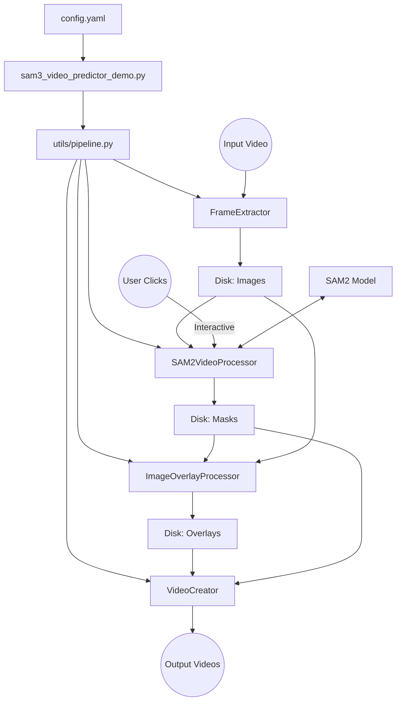

# SAM3 Project Architecture Analysis

This document provides a deep dive into the architecture of the SAM3 video segmentation project.

## High-Level Overview

The system is designed as a **batch-processing pipeline** for semi-automated video segmentation using the **SAM2 (Segment Anything Model 2)** architecture. It emphasizes user interaction for refining segmentation masks and automates the logistics of file handling (extraction, rendering, video creation).

### Core Workflow
1.  **Configuration**: Settings are loaded from YAML.
2.  **Extraction**: Video is broken down into individual frames.
3.  **Interactive Segmentation**: User clicks on objects to segment them. The system uses SAM2 to propagate these choices.
4.  **Verification**: Overlays are generated for user review.
5.  **Assembly**: Verified frames and masks are stitched back into video formats.

---

## Component Breakdown

### 1. Entry & Orchestration
*   **`sam3_video_predictor_demo.py`**: The entry point.
    *   **Role**: Batch Processor.
    *   **Function**: Iterates through a configured range of videos (e.g., Video 1 to 5). It prepares directories and calls the pipeline for each video.
*   **`utils/pipeline.py`**: The workflow manager.
    *   **Role**:  Sequencer.
    *   **Function**: Calls the specialized processors in order: `SAM2VideoProcessor` -> `ImageOverlayProcessor` -> `VideoCreator`.

### 2. The "Brain": Model & Interaction
*   **`utils/Model/sam2_video_predictor.py` -> `SAM2VideoProcessor`**:
    *   **Role**: The core logic class.
    *   **Inheritance**: Inherits from `SAM2Model`.
    *   **Key Responsibilities**:
        *   **State Management**: Manages the SAM2 inference state using `inference_state`.
        *   **Interaction**: Uses `UserInteractionHandler` to capture mouse clicks (left for positive, right for negative prompts).
        *   **Inference Loop**: processing batches of frames.
        *   **Propagation**: Calls `propagate_in_video` to extend segmentation across frames.
        *   **Auto-Prompting**: Uses `auto_prompt_encoding` to convert existing masks into box prompts for refinement.

*   **`utils/Model/SAM2Model.py`**:
    *   **Role**: Model Wrapper.
    *   **Function**: Handles the initialization of the underlying PyTorch model (`build_sam2_video_predictor`). It manages GPU/CPU device selection.

### 3. Data Processing & UI
*   **`utils/FileManagement` Package**:
    *   **`FrameExtractor.py`**: Uses OpenCV to convert input video -> sequence of images.
    *   **`MaskProcessor.py`**:
        *   Converts raw model outputs (logits) into binary/color masks.
        *   Extracts bounding boxes from masks (`mask_to_boxes`) to support the "auto-prompt" feature.
    *   **`ImageOverlayProcessor.py`**: Blends masks onto original images for visual verification.
    *   **`VideoCreator.py`**: Stitches images back into `.mp4` files.
*   **`utils/UserUI` Package**:
    *   **`UserInteractionHandler.py`**: Manages the OpenCV windows, zoom functionality, and collecting click coordinates.

---

## Data Flow Diagram

## Key Mechanisms

### The "Auto-Refinement" Loop
One interesting architectural choice is the `auto_prompt_encoding` in `SAM2VideoProcessor`.
1.  When a user prompts a frame, a mask is generated.
2.  If the user interacts again or moves to a step requiring refinement, the system calculates the **bounding box** of the *current* mask.
3.  This bounding box is fed back into SAM2 as a new prompt (`add_new_points_or_box`).
4.  This stabilizes the segmentation by explicitly telling the model "stay within this area" based on its own previous best guess.

### Batch Processing
The system handles images in batches (default size defined in config).
*   `SAM2VideoProcessor.run()` loads a batch of frames.
*   It copies them to a temp directory.
*   It runs the interaction loop for that batch.
*   It generates masks and then moves to the next batch.
*   This optimizes memory usage (not loading 10k frames at once) while allowing temporal propagation within the batch context.

## Output Specifications

The pipeline generates several types of outputs, organized into intermediate working files and final deliverables.

### 1. File Formats & Naming
*   **Images**: Standard `.jpg` or `.png`.
    *   Naming: `{prefix}{video_number}_{frame_index:05d}.{ext}` (e.g., `Img1_00001.png`).
*   **Masks**: **Color-mapped PNGs**.
    *   Masks are *not* binary. They use a predefined color palette to distinguish between different object instances (up to 10 unique instances per frame).
    *   Generated by `MaskProcessor.mask2colorMaskImg`.
*   **Videos**: `.mp4` files encoded with `mp4v`.

### 2. Directory Structure
*   **Working Directory** (Temporary/Staging):
    *   `inputs/`: Raw extracted frames.
    *   `rendered_masks/`: Color segmentation masks.
    *   `overlaps/`: Visualization of masks overlaying original frames.
*   **Verified Output** (Final Selection):
    *   `verified/images`: Only the frames that have been processed and implicitly "verified" by the user.
    *   `verified/masks`: Corresponding color masks.
*   **Final Videos**:
    *   `OrgVideo{N}.mp4`: Reconstructed video from verified raw frames.
    *   `MaskVideo{N}.mp4`: Reconstructed video from verified masks.
    *   `OverlappedVideo{N}.mp4`: Reconstructed video from the overlay visualizations.

### 3. Data Types
*   **Mask Data**: Saved as 3-channel (RGB) images where color <-> Object ID.
    *   The `MaskProcessor` handles the conversion from SAM2's internal logits to these color maps.

## Downstream Integration: Dataset Creation

After the SAM3 pipeline generates verified images and masks, the `DatasetManager` takes over to prepare data for model training (specifically YOLO).

### `DatasetCreator.py` Workflow
1.  **Input**: Consumes the `verified/images` and `verified/masks` directories.
2.  **Processing**:
    *   **Polygon Extraction**: Converts color masks into polygon coordinates (`get_polygons`).
    *   **Normalization**: Normalizes coordinates (0-1) for YOLO format.
    *   **Augmentation**: Applies transform operations (brightness, contrast, noise, blur) to multiply the dataset size (default 10x per image).
3.  **Output**: Structured YOLO dataset with `train`, `val`, `test` splits, each containing `images/` and `labels/`.

