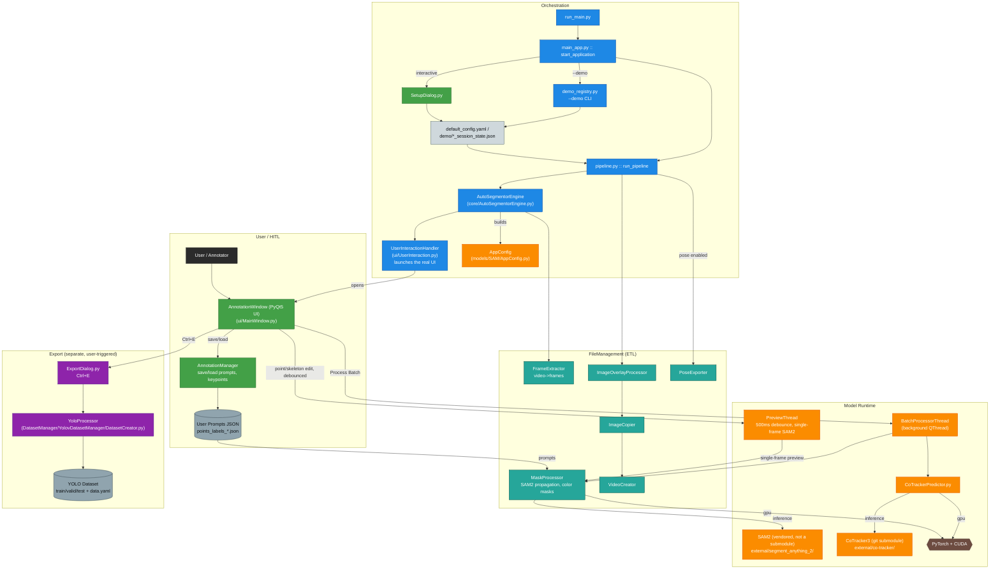

# Architecture

AutoSegmentor is a desktop app, not a script: a PyQt5 annotation window drives a background
engine that wraps two ML models — [SAM2](https://github.com/facebookresearch/segment-anything-2)
for mask propagation and [CoTracker3](https://github.com/facebookresearch/co-tracker) for
keypoint tracking — and a separate downstream tool turns the verified result into a
YOLO-ready training set. This page walks through how those pieces actually talk to each
other, end to end, on version 3.0.0.

---

## End-to-End Call Flow

```
run_main.py
  → autosegmentor/tools/main_app.py :: start_application()
      → (interactive)  ui/SetupDialog.py :: SetupDialog            — user picks video + config
      → (--demo <name>) tools/demo_registry.py :: resolve_demo()   — loads demo/<name>_session_state.json
    for each video:
      → pipeline.py :: run_pipeline()
          → core/AutoSegmentorEngine.py :: AutoSegmentorEngine(...)
              builds AppConfig, runs FrameExtractor (video → JPEGs), constructs
              AnnotationManager / MaskProcessor / UserInteractionHandler
          → engine.run()
              → ui/UserInteraction.py :: UserInteractionHandler.start_ui_loop()
                  lazily imports and opens the real PyQt5 UI:
                  → ui/MainWindow.py :: AnnotationWindow  (modal QDialog)
                      user places SAM2 prompts, presses "Process Batch" (Enter)
                      → BatchProcessorThread (background QThread)
                          → MaskProcessor.generate_mask()       — SAM2 propagation
                          → AutoSegmentorEngine._track_batch_cotracker()
                              → models/Tracking/CoTrackerPredictor.py — CoTracker3 tracking
          → (if pose enabled) file_management/PoseExporter.py :: process_masks()
          → ImageOverlayProcessor / ImageCopier / VideoCreator   — QC overlays, verified
            copies, reconstructed .mp4 outputs
      → (user presses Ctrl+E, separately from the above) ui/ExportDialog.py
          → DatasetManager/YolovDatasetManager/DatasetCreator.py :: YoloProcessor
              — builds the YOLO dataset (detection + segmentation + pose)
```

Two things that are easy to miss from a diagram alone:

- **The PyQt5 UI is not launched directly by `run_main.py` or `pipeline.py`.** It's opened
  by `UserInteractionHandler.start_ui_loop()` (`ui/UserInteraction.py`), which lazily
  imports `ui/MainWindow.py::AnnotationWindow` and runs it as a modal dialog. `pipeline.py`
  only ever talks to `AutoSegmentorEngine`, never to the UI classes directly.
- **YOLO export is a separate, user-triggered path**, not a pipeline stage. `pipeline.py`
  never imports anything from `DatasetManager/`. Export only happens when the user presses
  `Ctrl+E` in the UI, which opens `ExportDialog` and dynamically adds
  `DatasetManager/YolovDatasetManager` to `sys.path` to import `YoloProcessor`.

### Master System Architecture



---

## 1. Package Structure

| Directory | Role |
| :--- | :--- |
| `autosegmentor/core/` | `AutoSegmentorEngine.py` — the central orchestrator (subclasses `SAM2Model`); builds `AppConfig`, runs frame extraction, owns `MaskProcessor`/`AnnotationManager`/`UserInteractionHandler`. |
| `autosegmentor/ui/` | PyQt5 layer: `MainWindow.py` (`AnnotationWindow`), `AnnotationCanvas.py`, `SidePanel.py` (incl. Model Routing widget), `NavigationManager.py` (undo/redo), `SetupDialog.py`, `ExportDialog.py`, `AnnotationManager.py`, `UserInteraction.py` (the actual UI launcher), `UITheme.py`. |
| `autosegmentor/models/` | ML wrappers: `SAM/SAM2Model.py` + `AppConfig.py`, `Tracking/CoTrackerPredictor.py` + `LKKeypointTracker.py` (optical-flow fallback), `model_info.py` (checkpoint URLs/paths, shared by `install.py`). |
| `autosegmentor/file_management/` | ETL: `FrameExtractor.py`, `FrameHandler.py`, `MaskProcessor.py`, `ImageOverlayProcessor.py`, `ImageCopier.py`, `VideoCreator.py`, `PoseExporter.py`, `FileManager.py`. |
| `autosegmentor/tools/` | `main_app.py` (bootstrap), `demo_registry.py` (`--demo` CLI), `export_yolo_pose.py`, `visualize_pose_images.py` / `visualize_pose_video.py`. |
| `autosegmentor/pipeline.py` | Module-level `run_pipeline()` — orchestrates engine → pose export → overlays → verified copy → video assembly, per video. |
| `autosegmentor/tests/` | Test suite (pytest / pytest-qt). |
| `DatasetManager/` | Post-annotation dataset-build suite, invoked separately from the main pipeline — see [§4](#4-downstream-dataset-export-separate-from-the-pipeline). |
| `external/` | Vendored `segment_anything_2` (plain files, **not** a git submodule) and `co-tracker` (git submodule) — see `external/.gitmodules`. |
| `demo/` | Bundled demo footage + session-state JSON configs, resolved by `demo_registry.py`. |

---

## 2. The Async Threading Model

AutoSegmentor offloads heavy GPU/I-O work from the PyQt5 UI thread using two background
`QThread`s in `ui/MainWindow.py`:

### `PreviewThread`
- **Trigger**: a 500ms debounce timer (`_preview_debounce_timer`) that fires after the
  user stops navigating frames or after a point/skeleton edit — not on every keystroke, so
  holding A/D to scroll doesn't spam SAM2 inference.
- **Operation**: runs a single-frame SAM2 mask preview (`handler.user_prompt_adder_pyqt()`)
  off the main thread, then emits `preview_ready` → `AnnotationWindow._on_preview_ready`.
  If another preview is requested while one is already running, it's queued
  (`_preview_pending`) and re-run immediately after, so the UI always ends up showing the
  latest state rather than a stale one.

### `BatchProcessorThread`
- **Trigger**: user clicks "Process Batch" (or presses Enter) in `AnnotationWindow`.
- **Operation**:
    1. Propagates the current frame's mask across the batch via SAM2
       (`MaskProcessor.generate_mask`).
    2. Runs CoTracker3 across the same temporal window
       (`AutoSegmentorEngine._track_batch_cotracker` → `CoTrackerPredictor`).
    3. Persists results to disk and signals the UI to update once finished.

---

## 3. Scalable Model Routing

A per-point routing feature that lets the user decide, per annotation, whether it feeds
SAM2, CoTracker3 (pose), or both — useful when a scene needs segmentation on some objects
and only keypoint tracking on others.

- UI: `SidePanel`'s `model_routing` widget (`ui/SidePanel.py`), toggled via `Shift+S`
  (SAM) / `Shift+P` (pose) / `Shift+A` (select all) / `Shift+N` (select none) shortcuts
  registered in `MainWindow.py`.
- Wiring: `SidePanel.model_routing.routing_changed` → `MainWindow._on_routing_changed`,
  which updates `handler.active_target_models`; `_toggle_sam_routing` /
  `_toggle_pose_routing` flip individual targets. An "auto-shift" mode
  (`auto_shift_toggled` → `_on_auto_shift_toggled`) can advance routing automatically
  between prompts.

---

## 4. Downstream Dataset Export (separate from the pipeline)

Export is **not** a pipeline stage — it's triggered manually from the UI:

1. User presses `Ctrl+E` (or the sidebar's export button) → `MainWindow._on_export_yolo`
   opens `ui/ExportDialog.py`.
2. `ExportDialog` dynamically inserts `DatasetManager/YolovDatasetManager` onto `sys.path`
   and imports `DatasetCreator.py::YoloProcessor`.
3. `YoloProcessor` consumes verified images/masks from the workspace, converts masks to
   normalized polygons, applies augmentation, and writes a `train`/`valid`/`test` +
   `data.yaml` YOLO dataset covering detection (bbox), instance segmentation, and pose
   simultaneously.

### `DatasetManager/SyntheticEngine/` — a separate, offline tool

`SyntheticEngine` is **not** invoked by the annotation pipeline or by `ExportDialog`. It's
a standalone augmentation tool with its own `run.py`, used *after* export to multiply a
small verified dataset via copy-paste augmentation, simulated occlusions, and synced
geometric/photometric transforms across images, masks, and keypoints. Run it directly —
see the [Dataset Manager](dataset-manager.md) page, or
[`DatasetManager/SyntheticEngine/README.md`](https://github.com/thippeswammy/AutoSegmentor/blob/master/DatasetManager/SyntheticEngine/README.md)
in the repo.

`DatasetManager/DatasetHandler/` holds lower-level, standalone preprocessing utilities
(e.g. `Video2images.py`), also independent of the main pipeline.

---

## 5. CLI Surface & Demos

- `python run_main.py` — interactive mode, opens `SetupDialog`.
- `python run_main.py --version` — prints the version from `autosegmentor/_version.py`.
- `python run_main.py --demo list` / `--demo` / `--demo <name>` — automated mode.
  `autosegmentor/tools/demo_registry.py` discovers demos **by scanning
  `demo/*_session_state.json` on disk** (no hardcoded list): each file's `demo.name` field
  becomes the CLI name, so adding a new demo is just adding a new session-state JSON — no
  code change needed. `default_demo_name()` returns `"cat"`.

---

## 6. Output Specifications

### File formats & naming
- **Images**: `.jpg`/`.jpeg`, named `{prefix}{video_number}_{frame_index:05d}.jpeg`
  (`FrameExtractor`).
- **Masks**: color-mapped PNGs, up to 10 distinguishable instance IDs
  (`MaskProcessor.binary_mask_2_color_mask`).
- **Videos**: `.mp4`, `mp4v` codec (`VideoCreator`).

### Directory hierarchy
- **`workspace/working_dir/<video>/`** (intermediate): `images/`, `render/` (masks),
  `overlap/` (QC overlays), `temp/` (batch staging).
- **`workspace/working_dir/<video>/verified/`**: `images/` + `mask/` — the user-verified
  subset that everything downstream (pose export, video assembly, YOLO export) reads from.
- **`workspace/outputs/`**: reconstructed `OrgVideo*.mp4` / `MaskVideo*.mp4` /
  `OverlappedVideo*.mp4`.
- **`outputs/logs/`**: `autosegmentor.log`.

---

## 7. Key Technical Mechanisms

### Bounding-box auto-refinement
The current SAM2 mask's bounding box is fed back into the model as a new prompt each
batch — a self-correction loop that improves mask consistency across difficult frames.

### Batch-aware memory management
Frames are processed in configurable batches (e.g. 24–48) rather than loading an entire
video into VRAM, so long videos run on consumer-grade hardware.

### Keypoint visibility
CoTracker3's model outputs a per-keypoint, per-frame `pred_visibility` boolean directly
(`CoTrackerPredictor.py`) — this is CoTracker's own signal, not something AutoSegmentor
computes separately. The UI keeps a keypoint's regressed position visible even when
occluded (so it can be dragged back into place), and lets the user manually override
visibility via the `SidePanel` keypoint-progress widget (`visibility_toggled` signal,
`MainWindow.handle_visibility_toggled`). `PoseExporter` writes the resulting visibility
flags into the exported pose labels.

---

## 8. Versioning

`autosegmentor/_version.py` is the single source of truth (`__version__`), exposed via
`autosegmentor/__init__.py` and printed by `python run_main.py --version`.
